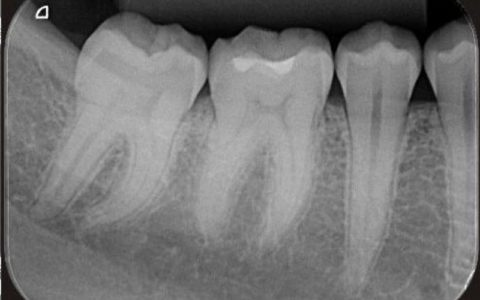

[comment]: # "This is the standard layout for the project, but you can clean this and use your own template"

# Using AI in determining alveolar bone loss in Dental X-rays to aid in periodontal diagnosis

#### Team

- E/18/297 Piumal Rathnayake [[Website](https://people.ce.pdn.ac.lk/students/e18/297), [Email](mailto:e18297@eng.pdn.ac.lk)]
- E/18/397 Shamod Wijerathne [[Website](https://people.ce.pdn.ac.lk/students/e18/397), [Email](mailto:e18397@eng.pdn.ac.lk)]
- E/18/402 Chathura Wimalasiri [[Website](https://people.ce.pdn.ac.lk/students/e18/402), [Email](mailto:e18402@eng.pdn.ac.lk)]

#### Supervisors

- Prof. Roshan Ragel [[Website](https://people.ce.pdn.ac.lk/staff/academic/roshan-ragel), [Email](mailto:roshanr@eng.pdn.ac.lk)]
- Dr. Isuru Nawinne [[Website](https://people.ce.pdn.ac.lk/staff/academic/isuru-nawinne/), [Email](mailto:isurunawinne@eng.pdn.ac.lk)]
- Dr. Sumudu Rasnayake [[Website](https://dental.pdn.ac.lk/Prosthetic/Dr.sumudu.php), [Email](mailto:srasnayaka@dental.pdn.ac.lk)]
- Dr. Dhanushka L Bandara [[Website](https://dental.pdn.ac.lk/Oral%20Medicine/Dr.Lewkebandara.php), [Email](mailto:dhanulb@dental.pdn.ac.lk)]
- Assoc. Prof. Vajira Thambawita [[Website](https://www.simula.no/people/vajira/), [Email](mailto:vajira@simula.no)] 

## Project Summary
This project focuses on leveraging Artificial Intelligence (AI) to enhance the diagnosis of periodontal disease by accurately determining alveolar bone loss from dental X-rays. Periodontal disease, a major cause of tooth loss, is often diagnosed by evaluating bone loss around teeth using periapical radiographs. Traditionally, this assessment requires manual interpretation by dental professionals, which may result in variability and potential human error.

The goal of this project is to develop an AI-powered solution capable of analyzing dental X-rays with high precision to measure alveolar bone loss. By training machine learning models on annotated radiographic datasets, the AI system will learn to detect patterns indicative of bone degradation and calculate the percentage of bone loss. This system will not only assist in diagnosing periodontitis but also provide a standardized, consistent, and efficient method for monitoring disease progression.

Key components of the project include:
1. Dataset Preparation: Collecting and annotating dental X-rays with information on bone loss.
2. AI Model Development: Training machine learning algorithms, such as convolutional neural networks (CNNs), to recognize bone loss in radiographs.
3. Validation and Testing: Evaluating the model's accuracy in real-world clinical settings to ensure reliable performance.
4. User Interface: Developing a user-friendly interface that allows dental professionals to upload radiographs, obtain AI-generated bone loss assessments, and receive treatment recommendations.

The AI system aims to assist dentists by reducing diagnostic errors, improving early detection of periodontitis, and enhancing treatment outcomes. This project has the potential to revolutionize periodontal diagnosis and pave the way for more precise and timely dental care.

#### This is an example of intraoral periapical (IOPA) radiograph image. 

 
## Links

[//]: # ( NOTE: EDIT THIS LINKS WITH YOUR REPO DETAILS )

- [Project Repository](https://github.com/cepdnaclk/e18-4yp-Using-AI-in-determining-alveolar-bone-loss-in-Dental-X-rays-to-aid-in-periodontal-diagnosis)
- [Project Page](https://cepdnaclk.github.io/e18-4yp-Using-AI-in-determining-alveolar-bone-loss-in-Dental-X-rays-to-aid-in-periodontal-diagnosis)
- [Department of Computer Engineering](http://www.ce.pdn.ac.lk/)
- [University of Peradeniya](https://eng.pdn.ac.lk/)

[//]: # "Please refer this to learn more about Markdown syntax"
[//]: # "https://github.com/adam-p/markdown-here/wiki/Markdown-Cheatsheet"
